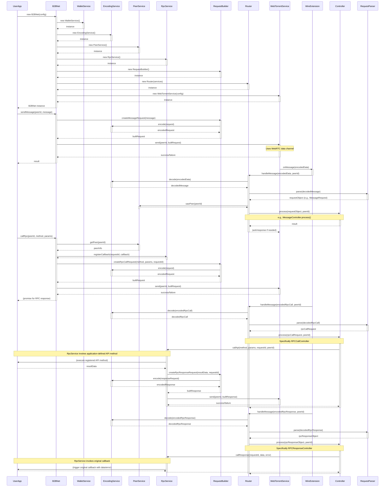

```mermaid
sequenceDiagram
    participant UserApp
    participant B2BNet
    participant WalletService
    participant EncodingService
    participant PeerService
    participant RpcService
    participant RequestBuilder
    participant Router
    participant WebTorrentService
    participant WireExtension
    participant Controller

    %% 1. B2BNet Initialization
    UserApp->>B2BNet: new B2BNet(config)
    activate B2BNet
    B2BNet->>WalletService: new WalletService()
    activate WalletService
    WalletService-->>B2BNet: instance
    deactivate WalletService
    B2BNet->>EncodingService: new EncodingService()
    activate EncodingService
    EncodingService-->>B2BNet: instance
    deactivate EncodingService
    B2BNet->>PeerService: new PeerService()
    activate PeerService
    PeerService-->>B2BNet: instance
    deactivate PeerService
    B2BNet->>RpcService: new RpcService()
    activate RpcService
    RpcService-->>B2BNet: instance
    deactivate RpcService
    B2BNet->>RequestBuilder: new RequestBuilder()
    activate RequestBuilder
    RequestBuilder-->>B2BNet: instance
    deactivate RequestBuilder
    B2BNet->>Router: new Router(services)
    activate Router
    Router-->>B2BNet: instance
    deactivate Router
    B2BNet->>WebTorrentService: new WebTorrentService(config)
    activate WebTorrentService
    WebTorrentService-->>B2BNet: instance
    deactivate WebTorrentService
    B2BNet-->>UserApp: B2BNet instance
    deactivate B2BNet

    %% 2. Outbound Message Flow (e.g., sending a simple message)
    UserApp->>B2BNet: sendMessage(peerId, message)
    activate B2BNet
    B2BNet->>RequestBuilder: createMessageRequest(message)
    activate RequestBuilder
    RequestBuilder->>EncodingService: encode(request)
    activate EncodingService
    EncodingService-->>RequestBuilder: encodedRequest
    deactivate EncodingService
    RequestBuilder-->>B2BNet: builtRequest
    deactivate RequestBuilder
    B2BNet->>WebTorrentService: send(peerId, builtRequest)
    activate WebTorrentService
    Note over WebTorrentService: Uses WebRTC data channel
    WebTorrentService-->>B2BNet: success/failure
    deactivate WebTorrentService
    B2BNet-->>UserApp: result
    deactivate B2BNet

    %% 3. Inbound Message Flow
    WebTorrentService->>WireExtension: onMessage(encodedData)
    activate WireExtension
    WireExtension->>Router: handleMessage(encodedData, peerId)
    deactivate WireExtension
    activate Router
    Router->>EncodingService: decode(encodedData)
    activate EncodingService
    EncodingService-->>Router: decodedMessage
    deactivate EncodingService
    Router->>RequestParser: parse(decodedMessage)
    activate RequestParser
    RequestParser-->>Router: requestObject (e.g., MessageRequest)
    deactivate RequestParser
    Router->>PeerService: sawPeer(peerId)
    activate PeerService
    PeerService-->>Router:
    deactivate PeerService
    Router->>Controller: process(requestObject, peerId)
    Note over Router,Controller: e.g., MessageController.process()
    activate Controller
    Controller-->>Router: result
    deactivate Controller
    Router-->>WebTorrentService: (ack/response if needed)
    deactivate Router

    %% 4. Outbound RPC Call
    UserApp->>B2BNet: callRpc(peerId, method, params)
    activate B2BNet
    B2BNet->>PeerService: getPeer(peerId)
    activate PeerService
    PeerService-->>B2BNet: peerInfo
    deactivate PeerService
    B2BNet->>RpcService: registerCallback(requestId, callback)
    activate RpcService
    RpcService-->>B2BNet:
    deactivate RpcService
    B2BNet->>RequestBuilder: createRpcCallRequest(method, params, requestId)
    activate RequestBuilder
    RequestBuilder->>EncodingService: encode(request)
    activate EncodingService
    EncodingService-->>RequestBuilder: encodedRequest
    deactivate EncodingService
    RequestBuilder-->>B2BNet: builtRequest
    deactivate RequestBuilder
    B2BNet->>WebTorrentService: send(peerId, builtRequest)
    activate WebTorrentService
    WebTorrentService-->>B2BNet: success/failure
    deactivate WebTorrentService
    B2BNet-->>UserApp: (promise for RPC response)
    deactivate B2BNet

    %% 5. Inbound RPC Call Handling (Peer receives RPC call)
    WireExtension->>Router: handleMessage(encodedRpcCall, peerId)
    activate Router
    Router->>EncodingService: decode(encodedRpcCall)
    activate EncodingService
    EncodingService-->>Router: decodedRpcCall
    deactivate EncodingService
    Router->>RequestParser: parse(decodedRpcCall)
    activate RequestParser
    RequestParser-->>Router: rpcCallRequest
    deactivate RequestParser
    Router->>Controller: process(rpcCallRequest, peerId)
    Note over Router,Controller: Specifically RPCCallController
    activate Controller
    Controller->>RpcService: callApi(method, params, requestId, peerId)
    activate RpcService
    Note over RpcService,UserApp: RpcService invokes application-defined API method
    RpcService->>UserApp: (execute registered API method)
    UserApp-->>RpcService: resultData
    RpcService->>RequestBuilder: createRpcResponseRequest(resultData, requestId)
    activate RequestBuilder
    RequestBuilder->>EncodingService: encode(responseRequest)
    activate EncodingService
    EncodingService-->>RequestBuilder: encodedResponse
    deactivate EncodingService
    RequestBuilder-->>RpcService: builtResponse
    deactivate RequestBuilder
    RpcService->>WebTorrentService: send(peerId, builtResponse)
    activate WebTorrentService
    WebTorrentService-->>RpcService: success/failure
    deactivate WebTorrentService
    RpcService-->>Controller:
    deactivate RpcService
    Controller-->>Router:
    deactivate Controller
    deactivate Router

    %% 6. Inbound RPC Response Handling (Original caller receives RPC response)
    WireExtension->>Router: handleMessage(encodedRpcResponse, peerId)
    activate Router
    Router->>EncodingService: decode(encodedRpcResponse)
    activate EncodingService
    EncodingService-->>Router: decodedRpcResponse
    deactivate EncodingService
    Router->>RequestParser: parse(decodedRpcResponse)
    activate RequestParser
    RequestParser-->>Router: rpcResponseObject
    deactivate RequestParser
    Router->>Controller: process(rpcResponseObject, peerId)
    Note over Router,Controller: Specifically RPCResponseController
    activate Controller
    Controller->>RpcService: callResponse(requestId, data, error)
    activate RpcService
    Note over RpcService,UserApp: RpcService invokes original callback
    RpcService->>UserApp: (trigger original callback with data/error)
    UserApp-->>RpcService:
    RpcService-->>Controller:
    deactivate RpcService
    Controller-->>Router:
    deactivate Controller
    deactivate Router

```
