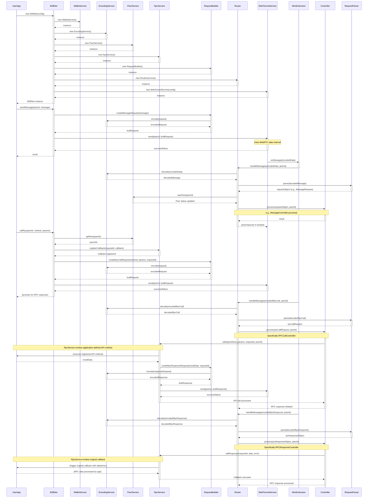

# B2BNet

B2BNet is a TypeScript library that enables peer-to-peer (P2P) networking directly between web browsers. It likely leverages technologies like WebRTC and WebTorrent to facilitate this direct browser-to-browser communication.

## Architecture Overview

## Features and Utility

B2BNet is a TypeScript library designed to simplify the development of peer-to-peer (P2P) applications that run directly in web browsers. It provides a higher-level abstraction over the complexities of underlying P2P technologies like WebRTC and WebTorrent, making it easier for developers to build decentralized browser-based applications.

Key utilities of the B2BNet library include:

*   **Simplification of P2P Development:** B2BNet offers a more accessible API compared to working directly with the low-level details of WebRTC and WebTorrent. This allows developers to focus on application logic rather than the intricacies of P2P connectivity, signaling, and data exchange.

*   **Peer Management:** The library handles crucial aspects of peer lifecycle management. This includes discovering other peers in the network, establishing connections, tracking the status of connected peers, and managing connection timeouts or disconnections. This is likely managed through services like `src/services/peer.ts`.

*   **Message Encoding and Encryption:** B2BNet manages the serialization and deserialization of messages exchanged between peers, ensuring data is correctly formatted for transmission. Furthermore, it likely incorporates encryption capabilities, potentially using libraries like `tweetnacl` (suggested by the presence of `src/services/encryption.ts`), to secure communications between peers.

*   **Remote Procedure Calls (RPC):** The library provides an RPC mechanism (likely found in `src/services/rpc.ts` and `src/controllers/rpccall.ts`), enabling peers to define functions that can be remotely invoked by other peers. This simplifies the implementation of complex interactions and distributed logic within the P2P network.

*   **Leveraging WebTorrent:** B2BNet likely utilizes WebTorrent for efficient data transfer and robust connectivity. WebTorrent's ability to use BitTorrent protocols over WebRTC data channels can enhance data exchange speeds and help in NAT traversal, improving overall P2P connection reliability. The presence of `src/services/torrent.ts` supports this.

*   **Event-Driven Architecture:** The library employs an event-driven model (suggested by `src/services/events.ts`), allowing applications to react to various network events. This can include events like new peer connections, disconnections, incoming messages, or RPC calls, enabling developers to build responsive and dynamic P2P applications.

*   **Facilitating Decentralization:** By simplifying browser-to-browser communication and reducing the need for central servers for many operations, B2BNet empowers developers to build more decentralized applications. This can lead to increased user privacy, reduced operational costs, and greater resilience against single points of failure.

## Potential Use Cases

B2BNet, as a library facilitating direct browser-to-browser (P2P) networking, opens up possibilities for a variety of decentralized applications and features. By removing or reducing reliance on central servers, these applications can offer enhanced privacy, lower operational costs, and increased resilience.

Here are some potential use cases for the B2BNet library:

*   **Decentralized Chat Applications:**
    *   Users can chat directly with each other without messages passing through a central server, enhancing privacy.
    *   Group chats can be formed by connecting multiple peers directly.

*   **Collaborative Editing Tools:**
    *   Real-time collaborative document editing (like Google Docs, but P2P) where changes are synced directly between users' browsers.
    *   Shared whiteboards or design tools where multiple users can draw or contribute simultaneously.

*   **P2P File Sharing Systems:**
    *   Users can share files directly from their browser to another user's browser without needing to upload them to a server first.
    *   This can be useful for sharing large files or for creating private file-sharing networks.

*   **Multiplayer Browser Games with P2P Communication:**
    *   Reduce latency in real-time multiplayer games by sending game state updates directly between players.
    *   Host game sessions without relying on dedicated game servers, especially for smaller, private game rooms.

*   **Video/Audio Streaming Directly Between Users:**
    *   One-to-one or small group video and audio calls directly between browsers, similar to WebRTC-based calling apps but potentially with custom signaling and features built on B2BNet.
    *   Live streaming of user-generated content directly to a limited number of viewers in a P2P fashion.

*   **Decentralized Social Media Feeds:**
    *   Users could share updates or content directly with their followers in a P2P manner, reducing reliance on a central platform.

*   **P2P Data Synchronization:**
    *   Synchronizing application data (e.g., settings, local databases) across a user's multiple devices/browsers directly.

*   **IoT Device Communication via Browser Gateways:**
    *   Browsers acting as gateways to communicate with local IoT devices, and then relaying that information to other browsers or devices in a P2P network.

*   **Content Delivery Networks (CDNs) - Browser-assisted delivery:**
    *   Users who have already downloaded a piece of content can help serve it to other nearby users, reducing load on origin servers (similar to Peertube's model).

These use cases leverage B2BNet's core strength: enabling direct, secure, and efficient communication channels between web browsers, paving the way for more innovative and user-centric web applications.

## Installation

(Details on how to install and integrate B2BNet into a project will be added here.)

## Getting Started

(A simple example of how to use the library will be added here.)

## API Reference

(Link to API documentation or key API points will be added here.)

## Contributing

(Guidelines for contributing to the project will be added here.)

## License

This project is licensed under the terms of the LICENSE file.
This project is licensed under the terms of the LICENSE file.
